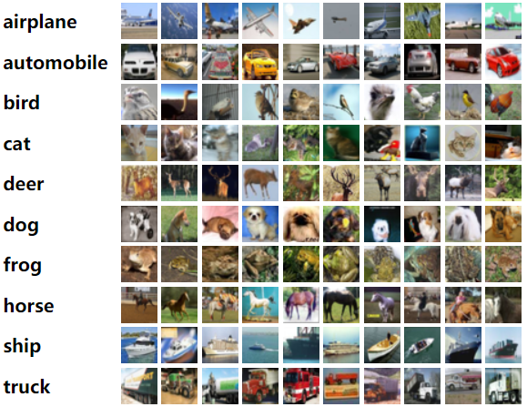

# CIFAR-10 Image Classification

This repository contains code and resources for training and evaluating image classification models on the CIFAR-10 dataset. CIFAR-10 is a widely used dataset for benchmarking machine learning algorithms in the field of computer vision.

